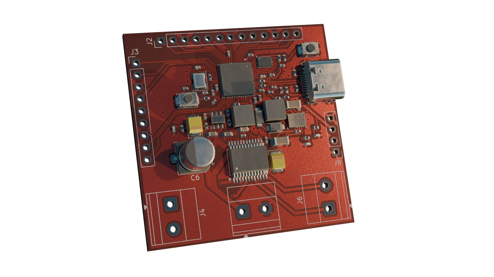
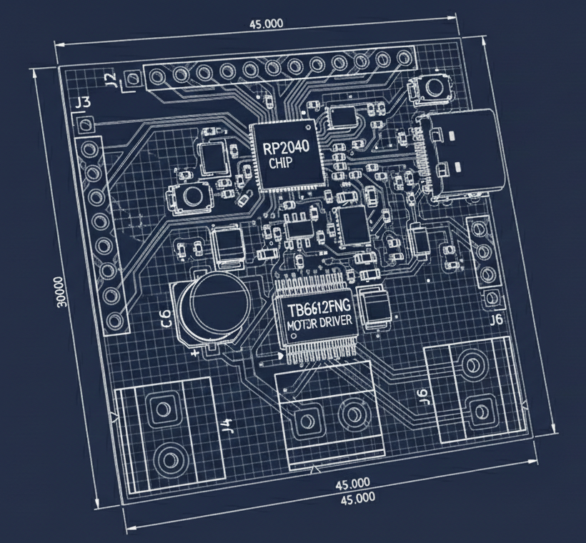
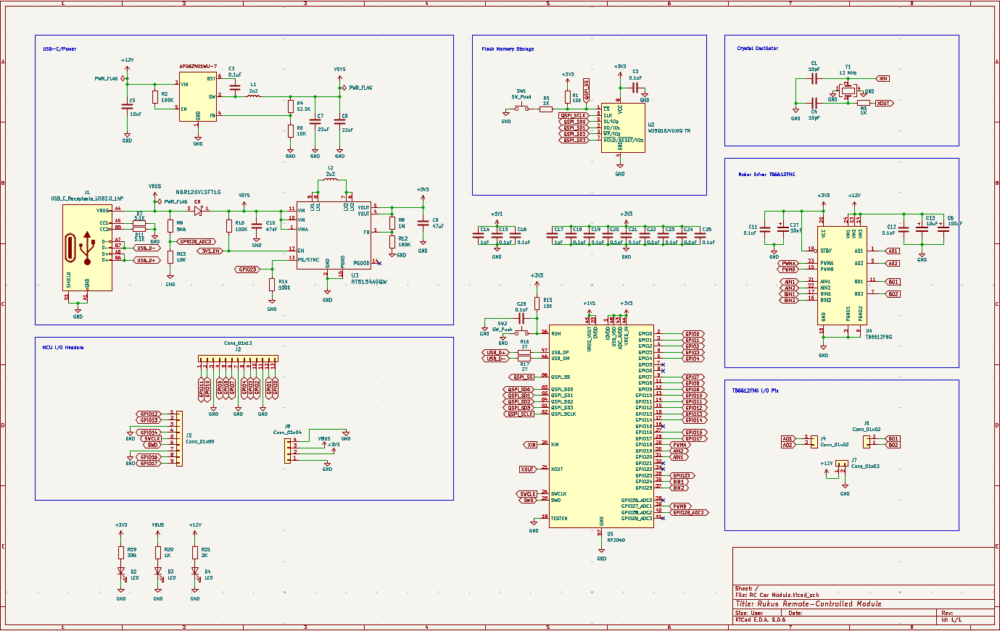
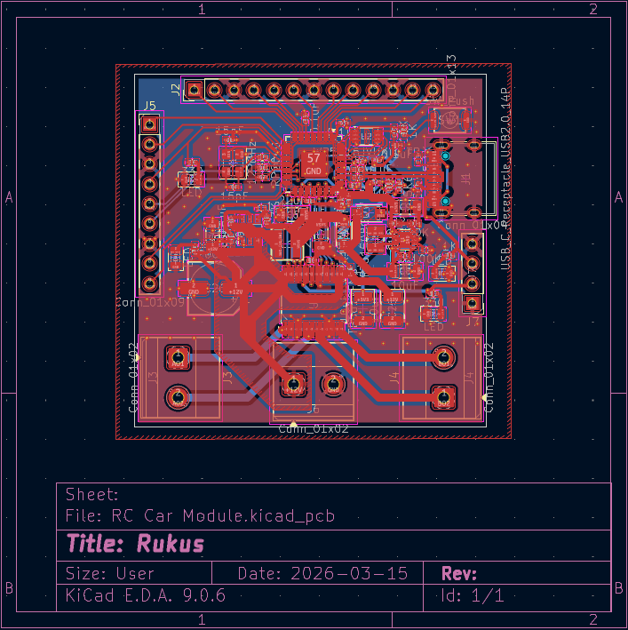
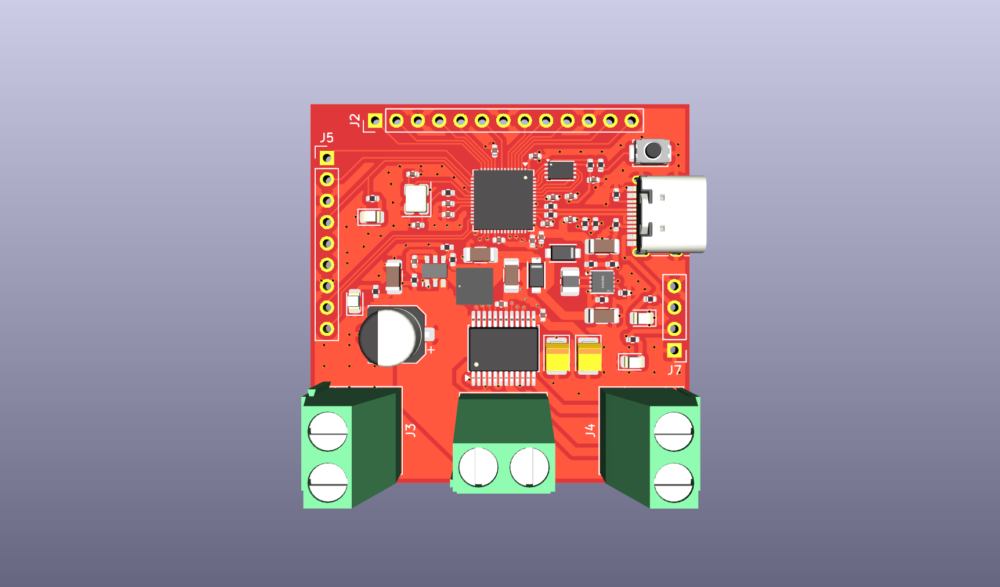
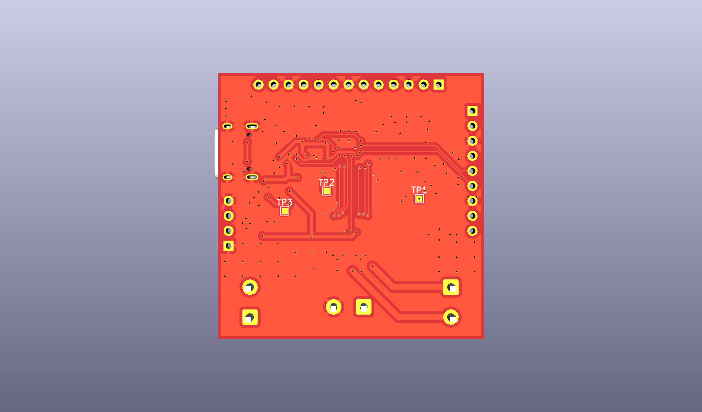

# Remote-controlled Car Module
After learning RP2040, I decided to build an RC Car module based off that. Let’s start with embedding an RP2040 into a PCB with a TB6612FNG, and later on we’ll add radio!!!

## Components
- RP2040 + Crystal + Flash Storage
- USB-C for MCU power supply + communication
- TB6612FNG motor driver
- nrf24l01 radio receiver

## Images

## Conclusion
This is my fourth project using RP2040 chip, which I thought would be easy. But I still faced lots challenges like adding votlage converters to avoid using more than one batteries and my misunderstanding of PWM arrnagement. There are only 8 slices of PWM in RP2040, and I didn't know that I had to be careful because each slice could only be set to one frequency tho it still allows different duty cycles.