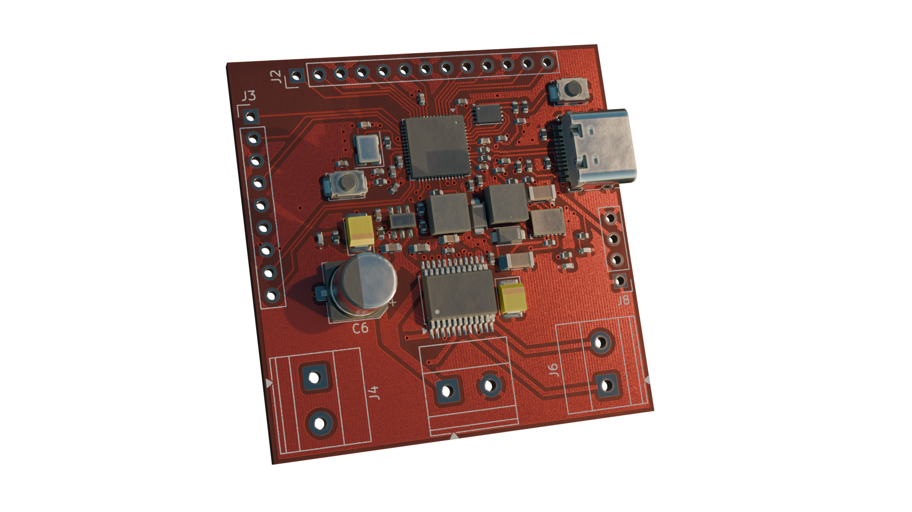
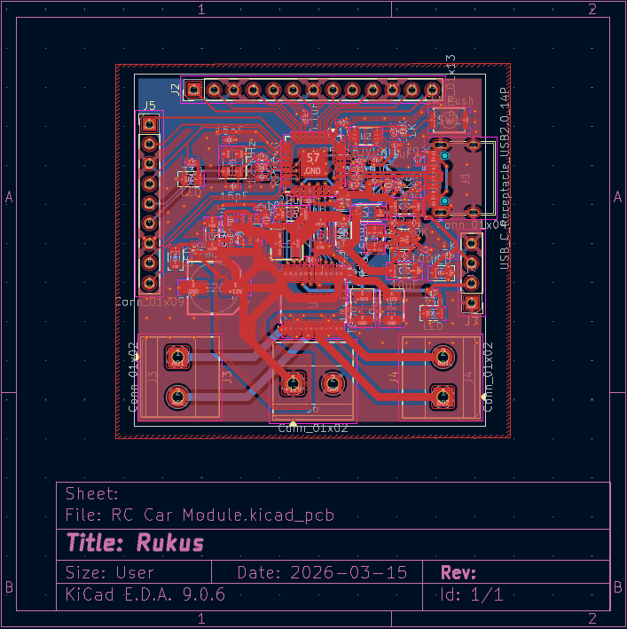
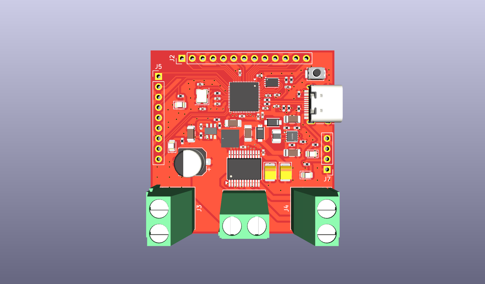
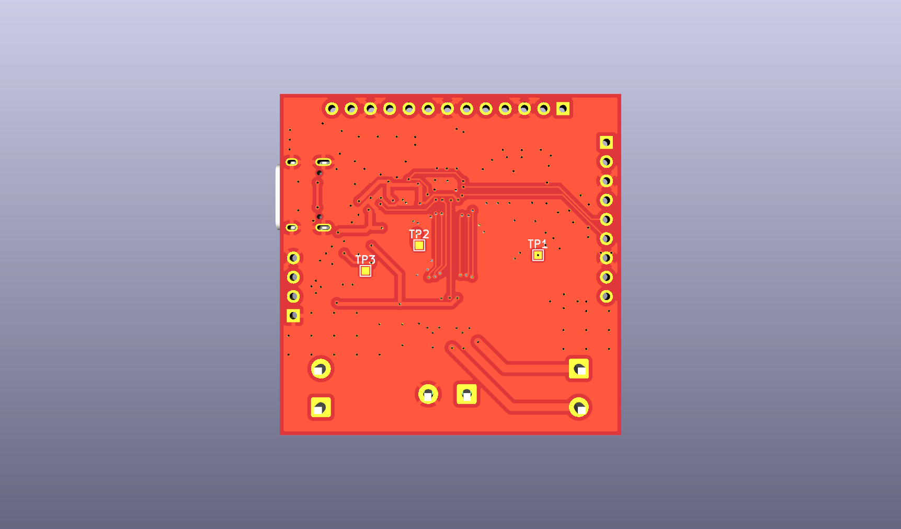

# Rukus: Pocket Robotics Control Computer
After learning RP2040, I decided to build an RC Car module based off that. Let’s start with embedding an RP2040 into a PCB with a TB6612FNG, and later on we’ll add radio!!!

## Demo Video
https://github.com/user-attachments/assets/a237940f-da78-4733-91b2-979578ba8ca9

https://github.com/user-attachments/assets/f6da3c5c-2f20-4054-9eab-c4b8ad8e2e0a

## Components
- RP2040
- 12MHz Crystal (ABM8-272-T3)
- 4MB Flash Storage (W25Q16JVUXIQ)
- Buck-Boost Switching Regulator 5V to 3V3 (RT6150BGQW)
- Buck-Boost Switching Regulator 12V to 5V (AP64201)
- USB-C (TYPE-C-31-M-12)
- Motor Driver (TB6612FNG)

## PCBs

### PCB Schematic

### PCB Layouts

### 3D Model

## Conclusion
This is my fourth project using RP2040 chip, which I thought would be easy. But I still faced lots challenges like adding votlage converters to avoid using more than one batteries and my misunderstanding of PWM arrnagement. There are only 8 slices of PWM in RP2040, and I didn't know that I had to be careful because each slice could only be set to one frequency tho it still allows different duty cycles.
